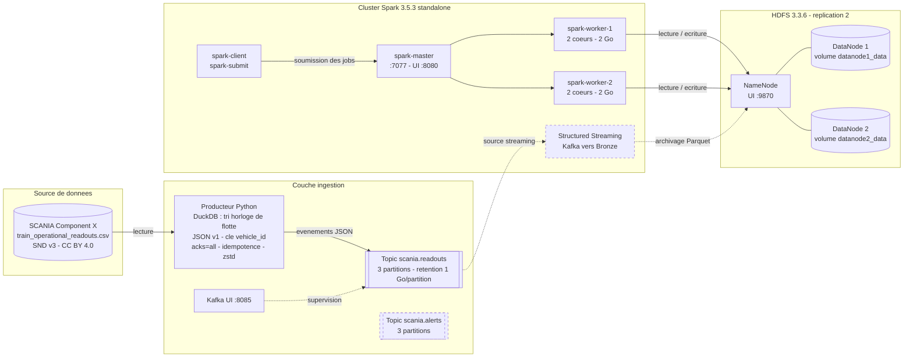

# Architecture - Livrable 1

Traits pleins : composants operationnels (S1). Pointilles : prevus (S2 et S6).

```mermaid
flowchart LR
    subgraph SRC["Source de donnees"]
        CSV[("SCANIA Component X<br/>train_operational_readouts.csv<br/>SND v3 - CC BY 4.0")]
    end

    subgraph ING["Couche ingestion"]
        PROD["Producteur Python<br/>DuckDB : tri horloge de flotte<br/>JSON v1 - cle vehicle_id<br/>acks=all - idempotence - zstd"]
        T1[["Topic scania.readouts<br/>3 partitions - retention 1 Go/partition"]]
        T2[["Topic scania.alerts<br/>3 partitions"]]
        UI["Kafka UI :8085"]
    end

    subgraph SPARK["Cluster Spark 3.5.3 standalone"]
        SC["spark-client<br/>spark-submit"]
        SM["spark-master<br/>:7077 - UI :8080"]
        W1["spark-worker-1<br/>2 coeurs - 2 Go"]
        W2["spark-worker-2<br/>2 coeurs - 2 Go"]
        SS["Structured Streaming<br/>Kafka vers Bronze"]
    end

    subgraph HDFS["HDFS 3.3.6 - replication 2"]
        NN["NameNode<br/>UI :9870"]
        DN1[("DataNode 1<br/>volume datanode1_data")]
        DN2[("DataNode 2<br/>volume datanode2_data")]
    end

    CSV -->|lecture| PROD
    PROD -->|evenements JSON| T1
    UI -.->|supervision| T1
    SC -->|soumission des jobs| SM
    SM --> W1
    SM --> W2
    W1 & W2 -->|lecture / ecriture| NN
    NN --- DN1
    NN --- DN2
    T1 -.->|source streaming| SS
    SS -.->|archivage Parquet| NN

    classDef planned stroke-dasharray: 5 5
    class SS,T2 planned
```